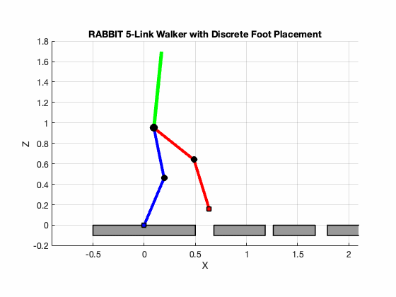

:::writing block
# RABBIT Bipedal Robot – MATLAB Simulation Framework

A modular MATLAB framework for modeling, simulation, control, and trajectory optimization of the **RABBIT planar five‑link biped robot**.  
The project implements hybrid dynamical walking, controllers, and trajectory optimization tools commonly used in nonlinear locomotion research.



## Overview

This repository provides a structured implementation of the RABBIT robot including:

- Robot modeling and kinematics  
- Symbolic rigid‑body dynamics  
- Constrained contact dynamics  
- Hybrid impact/reset maps  
- Walking simulation  
- Controllers (PD, Feedback Linearization, Hybrid Zero Dynamics)  
- Hybrid Zero Dynamics (HZD) framework  
- Trajectory optimization via direct collocation  
- Visualization and animation tools  

The architecture is designed for:

- nonlinear control research  
- hybrid locomotion studies  
- robotics education  
- trajectory optimization experiments  

---

## Robot Model

The **RABBIT robot** is a planar five‑link underactuated biped consisting of:

- stance leg  
- swing leg  
- torso  

The generalized coordinates are

q = [px, pz, qₜ, q₁, q₂, q₃, q₄]ᵀ

where

- px, pz — base position  
- qₜ — torso angle  
- q₁, q₂ — stance leg joints  
- q₃, q₄ — swing leg joints  

---

## Repository Structure

```
RABBIT-Bipedal-Robot
│
├── main_demo.m              Main demo script
├── startup.m                Project initialization
├── rabbit_animation.gif     Example walking animation
│
├── Model/                   Robot parameters and kinematics
├── Dynamics/                Rigid-body dynamics implementation
├── Contact/                 Contact and impact handling
├── Reset_Map/               Hybrid reset map
├── Controller/              Control strategies
├── Simulation/              Hybrid walking simulation
├── Trajectory_Optimization/ Gait optimization
├── Visualization/           Animation utilities
├── Utilities/               Helper functions
├── Test/                    Verification tests
├── Results/                 Simulation outputs
```

---

## Quick Start

Clone the repository:

```
git clone https://github.com/M-Malek132/RABBIT-Bipedal-Robot.git
cd RABBIT-Bipedal-Robot
```

Start MATLAB and run:

```
startup
main_demo
```

This will:

1. Initialize the project  
2. Run a multi‑step walking simulation  
3. Display an animation of the RABBIT robot  

---

## Controllers

The framework includes multiple control strategies:

- **PD Controller**
- **Feedback Linearization**
- **Hybrid Zero Dynamics (HZD)**

The HZD controller enables stable periodic walking gaits.

---

## Trajectory Optimization

The repository implements **direct collocation** methods to generate optimized walking gaits.

Key files:

- `direct_collocation.m`
- `gait_constraints.m`
- `optimize_gait.m`
- `rabbit_hzd_trajectory_optimization.m`

These tools allow generation of dynamically consistent periodic walking trajectories.

---

## Visualization

Robot motion can be visualized using:

```
animate_rabbit.m
```

Animations and simulation results can also be exported as GIFs.

---

## Applications

This framework is suitable for:

- studying hybrid dynamical systems  
- testing nonlinear controllers  
- gait optimization research  
- robotics coursework  
- rapid prototyping of walking algorithms  

---

## References

E. R. Westervelt, J. W. Grizzle, C. Chevallereau,  
J. H. Choi, and B. Morris  

**“Feedback Control of Dynamic Bipedal Robot Locomotion”**  
CRC Press, 2007.

---

## License

This project is released under the **MIT License**.

---

## Author

Mohammad Malek  
Robotics and Control Research
:::