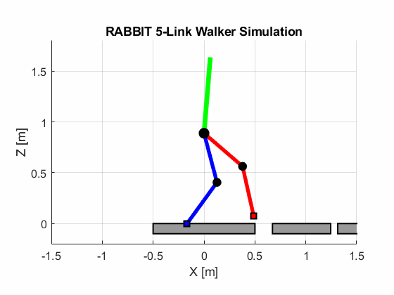
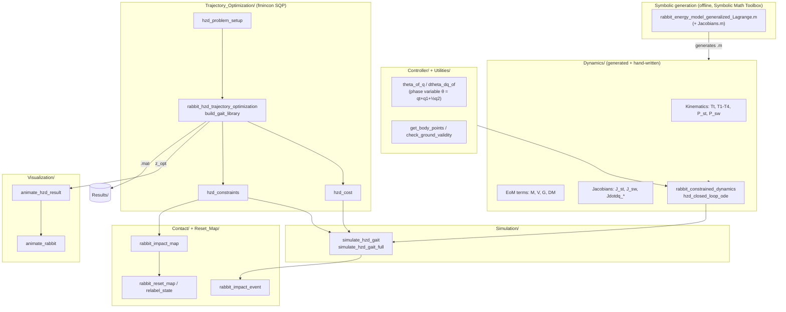

# RABBIT Bipedal Robot — MATLAB Simulation & HZD Gait Framework


A modular MATLAB framework for **modeling, simulation, control, and trajectory
optimization** of the **RABBIT planar five-link biped**. The centerpiece is a
working **Hybrid Zero Dynamics (HZD)** gait-optimization pipeline that produces
dynamically feasible, periodic walking gaits and animates them.



---

## Robot model

RABBIT is a planar, five-link, **underactuated** biped: a torso plus two legs,
each with a hip and knee. Generalized coordinates (7 DOF):

```
q = [ px, pz, qt, q1, q2, q3, q4 ]'
      └─ floating base ─┘  └ stance ┘ └ swing ┘
```

| symbol   | meaning                                   | actuated? |
|----------|-------------------------------------------|-----------|
| `px, pz` | torso base position (world frame)         | no        |
| `qt`     | torso pitch angle                         | no        |
| `q1, q2` | stance-leg hip, knee                      | **yes**   |
| `q3, q4` | swing-leg hip, knee                       | **yes**   |

Full state `x = [q; dq]` (14×1). Four actuators drive `q1..q4`; the floating
base `(px, pz, qt)` is unactuated → **one degree of underactuation** in single
support. Input map `B = [0₃ₓ₄; I₄]` (see `Dynamics/input_matrix.m`).

**Physical parameters** (baked into the symbolic derivation, *not* a separate
config file — see `Dynamics/rabbit_energy_model_generalized_Lagrange.m`,
nested `Mass_Properties`):

- Torso: 10 kg, length 0.75 m
- Each leg link (thigh, shank): 5 kg, length **0.5 m**
- Gravity: 9.8062 m/s²

> ⚠️ **World-frame Z is UP-positive** (ground = 0, above ground = positive),
> but `pz` is stored **down-positive** in the generalized coordinates. The
> world-frame hip height is therefore `-pz`. Mixing these conventions has been
> the source of several sign bugs; kinematic helpers (`P_st`, `P_sw`, `Tt`,
> `get_body_points`) all return **world-frame, up-positive** heights.

### Continuous dynamics

```
M(q)·q̈ + V([q;q̇]) + G(q) = B·u
```

- `M(q)` — mass/inertia matrix (`Dynamics/M.m`)
- `V([q;q̇])` — Coriolis/centrifugal vector (`Dynamics/V.m`)
- `G(q)` — gravity vector (`Dynamics/G.m`)

During single support the stance foot is pinned (holonomic contact
constraint); `Dynamics/rabbit_constrained_dynamics.m` solves the resulting
KKT system using the stance Jacobian `J_st`.

### Hybrid model

Walking is a hybrid system: **continuous** swing-phase dynamics punctuated by
a **discrete** impact when the swing foot strikes the ground.

- Guard / event: swing-foot height = 0 (`Contact/rabbit_impact_event.m`)
- Impact map: momentum-conserving velocity reset (`Contact/rabbit_impact_map.m`)
- Reset map: relabel stance/swing legs + re-plant on ground (`Reset_Map/rabbit_reset_map.m`)

---

## Dependencies

- **MATLAB** (developed against R2021a-era Symbolic Math Toolbox output)
- **Symbolic Math Toolbox** — only to *regenerate* the dynamics (`M`, `G`, `V`,
  `J_st`, …). The generated `.m` files are committed, so day-to-day use does
  **not** require it.
- **Optimization Toolbox** — `fmincon` (SQP) for gait optimization. **Required**
  for the HZD pipeline.

---

## Two pipelines in this repo

| | `Trajectory_Optimization/` (original) | `Chapter3/` (thesis pipeline) |
|---|---|---|
| virtual constraints | clamped cubic **B-spline** | **Bézier**, analytic derivatives |
| solver | single shooting (`ode45` in the loop) + collocation | direct collocation only |
| control | PD, optional CLF-QP | I/O linearization → PD → RES-CLF → CLF-QP → **constrained** CLF-QP |
| entry point | `rabbit_hzd_trajectory_optimization.m` | `Chapter3/ch3_main.m` |

`Chapter3/` is a from-scratch implementation of the Chapter 3 method. It reuses
**only** the generated robot model in `Dynamics/` and the B-spline evaluator;
everything else — hybrid model wrapper, virtual constraints, optimization,
controllers, simulation, analysis — is independent code with its own test
suite (`Chapter3/Test/ch3_test_all.m`). See
[Chapter3/README.md](Chapter3/README.md).

The two are independent and can be cross-checked against each other.

---

## Thesis chapters

Each chapter is a self-contained implementation with its own parameter file,
entry point and test suite. They build on each other in that order, but only
Chapters 3 and 4 are about RABBIT.

| chapter | subject | entry point | tests | notes |
|---|---|---|---|---|
| **3** | HZD gait design, I/O linearization, RES-CLF, constrained CLF-QP | `Chapter3/ch3_main.m` | `ch3_test_all` | [Chapter3/README.md](Chapter3/README.md), [CH3_OPTIMIZATION_FLOW.md](docs/CH3_OPTIMIZATION_FLOW.md) |
| **4** | model uncertainty: robust CLF-QP and L₁ adaptive control | `Chapter4/ch4_main.m` | `ch4_test_all` | [CH4_UNCERTAINTY.md](docs/CH4_UNCERTAINTY.md) |
| **5** | safety: Exponential Control Barrier Functions | `Chapter5/ch5_main.m` | `ch5_test_all` | [CH5_SAFETY.md](docs/CH5_SAFETY.md) |
| **6** | walking on stepping stones with CBFs; gait library | `Chapter6/ch6_main.m` | `ch6_test_all` | [Chapter6/README.md](Chapter6/README.md), [CH6_STEPPING_STONES.md](docs/CH6_STEPPING_STONES.md) |

**Chapter 5 does not use RABBIT.** The chapter validates ECBFs on two
purpose-built plants — a relative-degree-6 serial spring-mass system and a
relative-degree-4 two-link pendulum with elastic actuators — and only then
applies the method to walking. So `Chapter5/` carries its own models and shares
nothing with the rest of the repo but the code style.

```matlab
ch5_main                 % both studies + figures into Results/ch5_<stamp>/
ch5_test_all             % the full Chapter-5 test suite
```

**Chapter 6 comes back to RABBIT.** It is Chapter 3's QP with barrier rows
added: the constraint is *where the swing foot lands*, enforced by a condition
the foot never violates during the step, so precise footstep placement needs no
re-planning. Section 6.1.1's "modification of CBF for position based
constraints" turns out to be the relative-degree-2 case of Chapter 5's
Exponential CBF, and `ch6_test_barrier` asserts the two rows are identical.

```matlab
ch6_main                 % obstacles, stepping stones, moving stones, 3D, range
ch6_test_all             % the full Chapter-6 test suite (~15 s)
```

Section 6.3's robot (DURUS, 23 DoF) is **not modelled here**; that section is
split into geometry checked exactly with no robot, and a controller checked on a
swing-foot surrogate. Section 6.4's gait library is RABBIT's, not MARLO's. See
[CH6_STEPPING_STONES.md](docs/CH6_STEPPING_STONES.md) §3 for what is and is not
claimed.

---

## Quick start — the HZD gait pipeline (this is the working entry point)

```matlab
startup                              % add all folders to the path
cd Trajectory_Optimization
rabbit_hzd_trajectory_optimization   % optimize one gait, inspect, animate
```

This will:

1. Load parameters, bounds, and `fmincon` options (`hzd_problem_setup`).
2. Build an initial gait (hand-tuned `x0` + B-spline `make_coeffs`), optionally
   **warm-started** from a saved result in `Results/`.
3. Run `fmincon` to find a periodic gait (`hzd_cost` + `hzd_constraints`).
4. Print a full diagnostic breakdown (`inspect_solution`).
5. Save `Results/hzd_result_<timestamp>.mat` and animate 10 steps
   (`animate_hzd_result`).

To sweep walking speed and build a **gait library**:

```matlab
cd Trajectory_Optimization
build_gait_library                   % speed continuation around the seed gait
```

> A known-good seed gait (periodic, ~0.355 m/s) is saved at
> `Results/hzd_result_2026-07-20_12-06-36.mat` and is used as the default
> warm-start / continuation seed.

### ⚠️ Broken legacy entry points

The following predate the HZD pipeline and **do not run as-is** — they call
functions that no longer exist. They are kept for reference only:

| file | problem |
|------|---------|
| `main_demo.m` | calls `make_initial_state` with 3 outputs (it returns 1), `simulate_n_steps` with 4 args (it takes 3), and `animate_rabbit_stepping_stones` (does not exist) |
| `Controller/rabbit_controller.m` | calls `desired_gait` / `desired_gait_velocity` (do not exist) |
| `Dynamics/rabbit_dynamics.m` | calls `D_matrix` / `C_vector` / `G_vector` (do not exist; the real functions are `M` / `V` / `G`) |

Use `rabbit_hzd_trajectory_optimization.m` as the entry point instead.

---

## Data flow


```mermaid
flowchart TD
    subgraph GEN["Symbolic generation (offline, Symbolic Math Toolbox)"]
        ELM["rabbit_energy_model_generalized_Lagrange.m<br/>(+ Jacobians.m)"]
    end
    ELM -->|"generates .m"| DYN

    subgraph DYN["Dynamics/ (generated + hand-written)"]
        KIN["Kinematics: Tt, T1-T4, P_st, P_sw"]
        MAT["EoM terms: M, V, G, DM"]
        JAC["Jacobians: J_st, J_sw, Jdotdq_*"]
        CD["rabbit_constrained_dynamics<br/>hzd_closed_loop_ode"]
    end

    subgraph PHASE["Controller/ + Utilities/"]
        TH["theta_of_q / dtheta_dq_of<br/>(phase variable θ = qt+q1+½q2)"]
        GBP["get_body_points / check_ground_validity"]
    end

    subgraph OPT["Trajectory_Optimization/ (fmincon SQP)"]
        SETUP["hzd_problem_setup"]
        COST["hzd_cost"]
        CON["hzd_constraints"]
        MAIN["rabbit_hzd_trajectory_optimization<br/>build_gait_library"]
    end

    subgraph SIM["Simulation/"]
        SHG["simulate_hzd_gait<br/>simulate_hzd_gait_full"]
    end

    subgraph HYB["Contact/ + Reset_Map/"]
        EV["rabbit_impact_event"]
        IM["rabbit_impact_map"]
        RM["rabbit_reset_map / relabel_state"]
    end

    subgraph VIZ["Visualization/"]
        AR["animate_rabbit"]
        AHR["animate_hzd_result"]
    end

    DYN --> CD --> SHG
    PHASE --> CD
    SETUP --> MAIN
    MAIN --> COST --> SHG
    MAIN --> CON  --> SHG
    SHG --> EV
    CON --> IM --> RM
    MAIN -->|"z_opt"| AHR --> AR
    MAIN -->|".mat"| RES[("Results/")]
```

---

## Repository layout

Each folder has a `DOCS.md` with a file-by-file breakdown.

| folder | role | docs |
|--------|------|------|
| `Dynamics/` | symbolic-generated kinematics & equations of motion, constrained dynamics, closed-loop ODE | [Dynamics/DOCS.md](Dynamics/DOCS.md) |
| `Contact/` | impact event + impact (velocity reset) map | [Contact/DOCS.md](Contact/DOCS.md) |
| `Reset_Map/` | post-impact leg relabeling + re-plant | [Reset_Map/DOCS.md](Reset_Map/DOCS.md) |
| `Controller/` | phase variable + (legacy) controllers | [Controller/DOCS.md](Controller/DOCS.md) |
| `Trajectory_Optimization/` | **HZD gait optimization (main pipeline)** | [Trajectory_Optimization/DOCS.md](Trajectory_Optimization/DOCS.md) |
| `Chapter3/` | thesis Chapter 3: HZD, RES-CLF, constrained CLF-QP | [Chapter3/README.md](Chapter3/README.md) |
| `Chapter4/` | thesis Chapter 4: robust CLF-QP + L₁ adaptive control | [CH4_UNCERTAINTY.md](docs/CH4_UNCERTAINTY.md) |
| `Chapter5/` | thesis Chapter 5: Exponential CBFs (own plants, not RABBIT) | [CH5_SAFETY.md](docs/CH5_SAFETY.md) |
| `Simulation/` | single-step / gait integrators | [Simulation/DOCS.md](Simulation/DOCS.md) |
| `Utilities/` | body points + ground-validity checks | [Utilities/DOCS.md](Utilities/DOCS.md) |
| `Visualization/` | stick-figure animation + GIF export | [Visualization/DOCS.md](Visualization/DOCS.md) |
| `config/` | stepping-stone terrain + B-spline params (legacy) | [config/DOCS.md](config/DOCS.md) |
| `Test/` | smoke test | [Test/DOCS.md](Test/DOCS.md) |
| `Results/` | saved gaits (`.mat`), plots, animation GIF | — |

---

## Hybrid Zero Dynamics — implementation notes

The gait design follows Westervelt et al., *Feedback Control of Dynamic Bipedal
Robot Locomotion* (Ch. 6), and the RES-CLF thesis framing (see `DOCS` per
folder). Key implementation choices, and *why* they matter, are documented at
the point of use — a summary:

- **Phase variable is LINEAR in q.** `theta_of_q` returns
  `θ = qt + q1 + 0.5·q2 = c·q` with `c = [0 0 1 1 0.5 0 0]`
  (`dtheta_dq_of` returns the constant `c`). This is the absolute stance-leg
  angle (Westervelt HH6). An earlier `atan2`-based phase variable **wrapped at
  ±π** and derailed the optimizer; the linear form is provably identical over
  all physical poses but cannot wrap.
- **Virtual constraints.** The four actuated joints `q(4:7)` track a clamped
  cubic **B-spline** `yd(s)` (`bspline_eval`, using `BSpline` / `BSpline_derivative`),
  with phase `s = (θ − θ⁻) / (θ⁺ − θ⁻)` clamped to `[0,1]`. A PD law
  (`Kp=400, Kd=40`) zeroes the output error inside `hzd_closed_loop_ode`.
- **Decision vector** (`unpack_z`): `z = [ coeffs(:) ; x_start ]`, size
  `nu·n_coeffs + 14 = 4·6 + 14 = 38`.
- **Cost** (`hzd_cost`): integral of squared torque **per unit step length**
  (Westervelt eq. 6.43). Normalizing by step length prevents a degenerate
  "step in place".
- **Constraints** (`hzd_constraints`):
  - *Equality:* one-step **periodicity** (13), stance-foot on ground (1),
    stance-foot zero velocity (2), `θ_end = θ_plus` (1), and **NEC1** average
    walking rate `L_step / T_step = v_des` (1).
  - *Inequality (8):* no ground penetration, mid-step **swing-foot clearance**
    (NIC3), a **step-length floor** (prevents the degenerate scuff), **orbital
    stability** (`rho < 1`, gated), and the four **physical-realizability**
    limits — torque, friction cone, min vertical GRF, impact impulse (thesis
    Table 3.1, each individually gated). See `Trajectory_Optimization/DOCS.md`.
- **Solver** (`hzd_problem_setup`): `fmincon` SQP, **central** finite
  differences (the event-triggered `ode45` makes forward FD noisy),
  `ScaleProblem` **off** (so reported feasibility is comparable to the
  constraint tolerance).
- **Warm starting & continuation.** Cold starts from `x0` are unreliable;
  `build_gait_library` warm-starts each speed from the previously converged
  gait and marches `v_des` in small steps.

> **Known open item:** the stance foot is held only by an *acceleration-level*
> contact constraint, so `ode45` allows slow numerical **constraint drift**
> during a step. `inspect_solution` reports `stance-foot drift in step` to
> quantify it. This is independent of the optimization and does not invalidate
> a converged gait.

---

## Reproducibility

- **Generated dynamics files.** `Tt, T1–T4, P_st, P_sw, M, DM, V, G` are
  produced by `Dynamics/rabbit_energy_model_generalized_Lagrange.m`;
  `J_st, J_sw, Jdotdq_st, Jdotdq_sw` by `Dynamics/Jacobians.m`. **If you change
  any mass/length/inertia (in the nested `Mass_Properties`) or the kinematics,
  you must re-run these generator scripts** to regenerate the committed `.m`
  files. The generated files carry a "generated by Symbolic Math Toolbox"
  header — do not hand-edit them.
- **Saved results.** `Results/hzd_result_<timestamp>.mat` each contain
  `z_opt, p, fval, exitflag, report`. The `12-06-36` result is the reference
  periodic gait (≈0.355 m/s) used as the warm-start seed. `build_gait_library`
  writes `Results/gait_library_<timestamp>.mat` (`gait_library` struct array +
  `p`).
- **Nondeterminism.** `config/make_random_initial_state.m` uses `randn` with
  **no seed** — random initial states are not reproducible run-to-run. The HZD
  pipeline instead uses a **hard-coded** `x0`, so its results *are*
  reproducible. Add `rng(<seed>)` before random sampling if you need
  determinism there.
- **Orphaned cache.** `Trajectory_Optimization/Trajectory.mat` is committed but
  **not loaded by any code path**; treat its contents as unverified
  (`whos('-file', 'Trajectory.mat')` to inspect).
- **Simscape model.** `Dynamics/Test_dynamics_Simscape.slx` is a standalone
  dynamics cross-check, not part of the runtime pipeline.

---

## References

E. R. Westervelt, J. W. Grizzle, C. Chevallereau, J. H. Choi, B. Morris,
*Feedback Control of Dynamic Bipedal Robot Locomotion*, CRC Press, 2007.

See [docs/REFERENCES.md](docs/REFERENCES.md) for a curated reading list (HZD,
direct collocation, Poincaré stability, CLF-QP) mapped to the modules each
resource explains.

---

## Author

**Mohammad Malek** — Robotics & Control Research
· [malekmohammad.com](https://malekmohammad.com)
· [github.com/M-Malek132](https://github.com/M-Malek132)

## License

Released under the **MIT License**.
