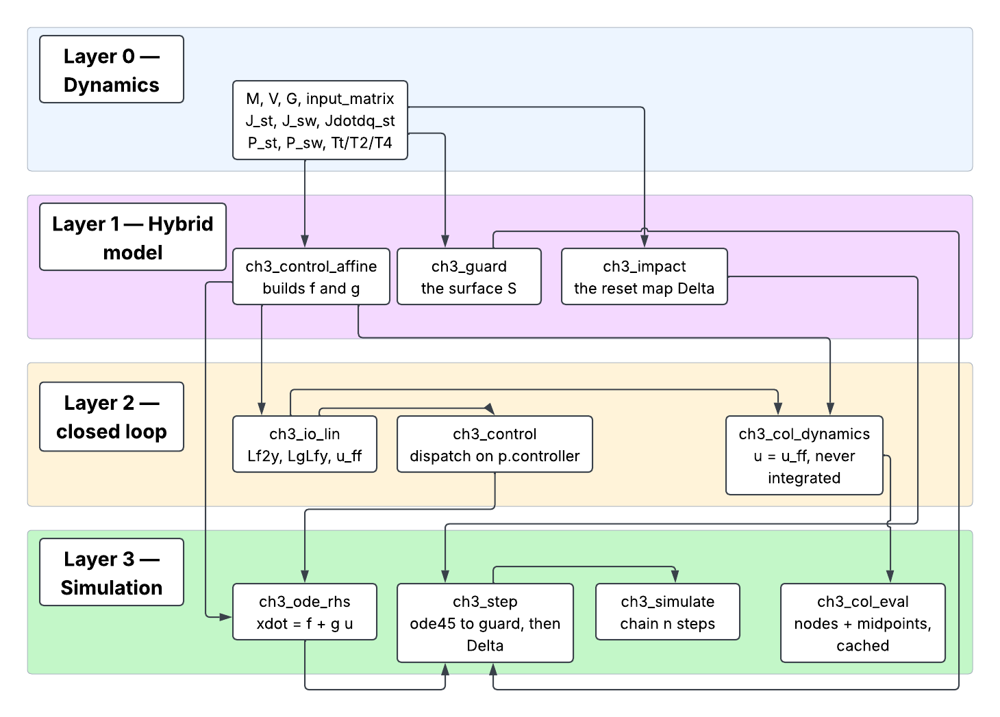

# Chapter 3 — reference

Everything about the Chapter 3 pipeline in one place: the big-picture handoff,
which function computes what, how stage 3 solves for the Bézier coefficients
`alpha`, and a deep read of the three functions that carry almost all of the
non-obvious reasoning in the package. `Chapter3/README.md` is the how-to
manual (quick start, entry points, design decisions); this is the
architectural reference underneath it.

- [Part I — The big picture](#part-i-the-big-picture)
- [Part II — Where stage 3 sits](#part-ii-where-stage-3-sits)
- [Part III — Function map](#part-iii-function-map)
- [Part IV — The optimization flow (stage 3)](#part-iv-the-optimization-flow-stage-3)
- [Part V — The three core functions](#part-v-the-three-core-functions)

---

## Part I — The big picture

One offline solve produces 24 numbers. The robot never sees the solve — only
those numbers, every timestep, for as long as it walks. [Part IV](#part-iv-the-optimization-flow-stage-3)
and [Part III](#part-iii-function-map) are detail underneath this handoff.


The top half runs once, before deployment. The loop at the bottom runs every
timestep, forever.

**Only `alpha` crosses.** Not the solver, not time `T` — the controller reads
the robot's own leg angle, not a clock, so it never needs to know the solve
happened at all.

For the full outer workflow (seeding, limit staging, continuation) and the
`fmincon` inner loop, see [Part IV](#part-iv-the-optimization-flow-stage-3).
For the runtime call chain (`ch3_simulate` → `ch3_step` → `ode45` →
`ch3_control` → `ch3_io_lin`), see [Part III](#part-iii-function-map).

---

## Part II — Where stage 3 sits

The chapter's eight stages are not eight steps. They are a **shared foundation
of three**, then **two flows that never meet at runtime**, then a verdict.


The three grey boxes across the top are stages 1, 2 and 4; the left column is
stage 3; the right column is stages 5-8.

**The foundation is shared, not duplicated.** Stages 1, 2 and 4 are pure
functions of the state — no decisions, no search. `ch3_io_lin` closes the chain
in two lines, calling stage 1 and stage 2 and joining them. The optimizer and
the robot call *the same code*, so there is no separate "planning model" that
can silently drift from the "control model".

**Only `alpha` crosses between the flows.** The decision vector is 235 numbers
at `N = 15`, but 210 of those are node states that exist purely to make the
dynamics algebraic inside `fmincon`. What the robot carries away is 24 numbers.

**`T` does not cross.** Note the runtime signature — `ch3_control(x, alpha, p)`
— and that `ch3_ode_rhs(~, x, alpha, p)` discards time entirely. The gait *has*
a duration (0.3009 s for the shipped reference gait), and the controller never
knows it. `T` is an output of the design, not an input to the control. This is
the phase variable of stage 2 cashing out at the architectural level: the robot
is not replaying a plan on a clock, it is obeying four joint relationships
indexed by its own leg angle, which is exactly why a disturbance re-indexes the
gait instead of desynchronising it.

**The offline flow does not use the online controller.** The solve runs under
`p.controller = 'ff'`, pure feedforward. The gait is designed *on* the zero
dynamics surface `Z = {eta = 0}`, where any feedback term multiplies zero. So
`p.controller` selects what **runs** a gait, never what **designs** it.

**The two flows meet only at verification.** `ch3_report` runs the forward
simulation and compares it against the collocation — on the reference gait,
step length 0.353 m and duration 0.301 s on all six steps, two independent
computations agreeing. Then `ch3_poincare` returns the spectral radius, because
periodicity is a property of the solve and stability is not
([Part IV §5](#periodic-is-not-stable)).

---

## Part III — Function map

Which function computes what, and who calls it. Derived from the call graph, not
from the folder layout — the two do not always agree.

### The layers



`ch3_ode_rhs` and `ch3_col_dynamics` are **parallel, not nested**. Both build on
`ch3_control_affine`, and the difference is the whole reason stage 3 and stages
5–8 can be reasoned about separately:

| | `ch3_ode_rhs` | `ch3_col_dynamics` |
|---|---|---|
| input `u` | from `ch3_control` (selected controller) | `u_ff` always |
| integrated? | yes, by `ode45` | **no** — only supplies `f_k` for the defects |
| lives in | the runtime branch | inside the `fmincon` loop |

### Layer 0 — generated primitives

All produced by
[`rabbit_energy_model_generalized_Lagrange.m`](../Dynamics/rabbit_energy_model_generalized_Lagrange.m).
These *are* the model; everything above is assembly.

| function | signature | returns | Chapter-3 callers |
|---|---|---|---|
| [`M`](../Dynamics/M.m) | `M(q)` | 7×7 mass matrix | `ch3_control_affine`, `ch3_impact` |
| [`V`](../Dynamics/V.m) | `V([q;dq])` | 7×1 Coriolis / centrifugal | `ch3_control_affine` |
| [`G`](../Dynamics/G.m) | `G(q)` | 7×1 gravity | `ch3_control_affine` |
| [`input_matrix`](../Dynamics/input_matrix.m) | `input_matrix()` | 7×4 `B` | `ch3_control_affine` |
| [`J_st`](../Dynamics/J_st.m) | `J_st(q)` | 2×7 stance-foot Jacobian | `ch3_control_affine`, `ch3_col_constraints` |
| [`J_sw`](../Dynamics/J_sw.m) | `J_sw(q)` | 2×7 swing-foot Jacobian | `ch3_guard`, `ch3_impact` |
| [`Jdotdq_st`](../Dynamics/Jdotdq_st.m) | `Jdotdq_st(q,dq)` | 2×1 | `ch3_control_affine` |
| [`P_st`](../Dynamics/P_st.m) | `P_st(q)` | 2×1 stance-foot position | 9 files — the widest-used primitive |
| [`P_sw`](../Dynamics/P_sw.m) | `P_sw(q)` | 2×1 swing-foot position | `ch3_guard`, `ch3_col_eval`, `ch3_step`, `ch3_forces` |
| `Tt`, `T2`, `T4` | `Tt(q)` | 4×4 homogeneous transform | `ch3_body_points` (drawing only) |

Foot positions are returned in the **world frame, z up-positive**. The
generalized coordinate `y` is stored **down-positive**, so world height is `−y`;
read heights from these helpers, never from `y`.

#### Not called at runtime

By *either* pipeline:

| function | status |
|---|---|
| `DM` | only the derivation script calls it — it is the intermediate that generates `V.m` |
| `Jdotdq_sw` | never called anywhere; would be needed only to constrain the swing foot at the acceleration level |
| `T1`, `T3` | never called outside the derivation |

### Layer 1 — `f`, `g`, and the hybrid map

| function | role |
|---|---|
| [`ch3_control_affine`](../Chapter3/Model/ch3_control_affine.m) | **the only place `f` and `g` are built.** One KKT factorization with five right-hand sides yields `ddq_drift`, `ddq_in`, `lam_drift`, `lam_in` exactly |
| [`ch3_guard`](../Chapter3/Model/ch3_guard.m) | `h(x)` = swing-foot height; defines the switching surface `S` |
| [`ch3_impact`](../Chapter3/Model/ch3_impact.m) | `Δ` = plastic impact → relabel → re-plant, in that order |
| [`ch3_relabel`](../Chapter3/Model/ch3_relabel.m) | leg index swap; called only by `ch3_impact` |

`ch3_control_affine` has **four call sites** in the entire package —
`ch3_io_lin`, `ch3_ode_rhs`, `ch3_step`, plus tests. Nothing else touches the
constrained dynamics directly.

### Layer 2 — closed loop

| function | role |
|---|---|
| [`ch3_io_lin`](../Chapter3/Control/ch3_io_lin.m) | joins stages 1 and 2 → `Lf2y`, `LgLfy`, `u_ff` |
| [`ch3_control`](../Chapter3/Control/ch3_control.m) | single dispatch point on `p.controller` → `u` |
| [`ch3_ctrl_pd`](../Chapter3/Control/ch3_ctrl_pd.m) | stage 5 |
| [`ch3_ctrl_clf_qp`](../Chapter3/Control/ch3_ctrl_clf_qp.m) | stages 7 and 8 |
| [`ch3_res_clf`](../Chapter3/Control/ch3_res_clf.m), [`ch3_clf_eval`](../Chapter3/Control/ch3_clf_eval.m) | stage 6 — the CLF certificate |

Every torque consumer routes through `ch3_control`, which is what makes
"solve under PD, re-check under the constrained CLF-QP" a one-line experiment.

### Layer 3 — gait simulation

```
ch3_simulate(x0, alpha, p, n_steps)      chains steps, seeds each from Delta
    └─ ch3_step(x0, alpha, p)            ode45 to the guard, then Delta
         ├─ ch3_ode_rhs(t, x, alpha, p)  xdot = f + g*u
         │    ├─ ch3_control  ──► ch3_io_lin ──► ch3_control_affine
         │    └─ ch3_control_affine
         ├─ ch3_guard        (as the ode45 Events function)
         └─ ch3_impact       (applied at the end of the step)
```

`ch3_step` also holds two local helpers, `integrate_zoh` and `zoh_rhs`, used when
`p.control_dt > 0` — the sampled-data path required by the constrained CLF-QP.

`ch3_ode_rhs` receives `t` and discards it. The feedback is time-invariant by
construction; the argument survives only because `ode45` passes it.

#### Who calls the simulation

| caller | calls | why |
|---|---|---|
| [`ch3_report`](../Chapter3/Analysis/ch3_report.m) | `ch3_simulate` | forward-sim cross-check against the collocation |
| [`ch3_compare_controllers`](../Chapter3/Analysis/ch3_compare_controllers.m) | `ch3_simulate` | one gait under all three laws at 1 kHz |
| [`ch3_animate`](../Chapter3/Analysis/ch3_animate.m) | `ch3_simulate` | rendering |
| [`ch3_poincare`](../Chapter3/Analysis/ch3_poincare.m) | `ch3_step` | 26 single steps for the step-to-step Jacobian |
| [`ch3_col_seed`](../Chapter3/Optimization/ch3_col_seed.m) | `ch3_step` | feedforward rollout to build the seed |
| [`ch3_col_verify`](../Chapter3/Optimization/ch3_col_verify.m) | `ch3_ode_rhs` | tight rollout compared against the node states |

### The legacy stack

A complete second implementation lives in the repo root and is **not used by
Chapter 3**:

```
Dynamics/     rabbit_dynamics, rabbit_constrained_dynamics, rabbit_ode,
              hzd_ode_rhs, hzd_closed_loop_ode, clf_qp_closed_loop_ode,
              hzd_control_and_dynamics
Simulation/   simulate_one_step, simulate_n_steps, simulate_hzd_gait,
              simulate_hzd_gait_full, simulate_clf_gait
Contact/      rabbit_impact_map, rabbit_impact_event, impact_event_wrapper
Reset_Map/    rabbit_reset_map, relabel_state
Controller/   rabbit_controller, rabbit_clf_qp_controller, theta_of_q, dtheta_dq_of
```

The two stacks share Layer 0 and nothing else — **with one deliberate
exception**: [`rabbit_constrained_dynamics`](../Dynamics/rabbit_constrained_dynamics.m)
is called by [`ch3_test_model`](../Chapter3/Test/ch3_test_model.m) as an
independent reference for the control-affine split. Keeping that one link is
what makes the check meaningful; it is the only place the implementations are
compared against each other.

### How this map was derived

Grep for callers of each function name across `Chapter3/` and the legacy
folders, excluding the defining file itself. Two hits are **false positives** and
are excluded above:

- `M(` in `ch3_bezier.m` — the Bézier degree `M`, not the mass matrix.
- `V(` in `ch3_test_control.m` — the CLF value `V`, not the Coriolis vector.

So the mass matrix has exactly two Chapter-3 callers and the Coriolis vector
exactly one. Re-run the same grep after any refactor; a primitive quietly
gaining callers is usually a sign that Layer 1 has been bypassed.

---

## Part IV — The optimization flow (stage 3)

How stage 3 of the Chapter 3 pipeline actually solves for the Bézier
coefficients `alpha`. Everything here lives in
[`Chapter3/Optimization/`](../Chapter3/Optimization).

[Part II](#part-ii-where-stage-3-sits) places stage 3 within the chapter as a
whole. Everything in this part is about stage 3 itself, where there are
**two nested flows** — and conflating them is what makes the code hard to
read the first time:

1. the **outer workflow** — the sequence of solves you run to get from a
   hand-tuned pose to a verified, periodic, stable gait;
2. the **inner evaluation** — what happens on each of the thousands of function
   evaluations `fmincon` makes inside one of those solves.

### The outer workflow

![Chapter 3 outer workflow: a hand-tuned pose is seeded and rolled out into a
collocation problem z0. ch3_col_solve runs fmincon with speed and safety
limits disabled. ch3_col_verify checks the result against a true rollout: on
excess deviation, ch3_col_remesh refines the mesh and the solve retries with a
warm start; once verified, four limits (GRF, friction, torque, impulse) are
enabled one at a time, each re-verified. ch3_continuation then marches the
desired speed under those limits, warm-starting each step, and ch3_report plus
ch3_poincare produce the final reference gait.](figures/ch3_outer_workflow.svg)

#### Why the workflow has this shape

**The cold solve runs with NEC1 disabled.** NEC1 is the average-rate equality
`L_step / T = v_des`. Finding a *periodic* gait is the hard part of the problem;
pinning the speed at the same time is what makes a cold solve stall. Measured
from the hand seed, periodicity alone starts at a residual of 0.78 while NEC1
starts at 0 — the seed trivially walks at its own speed — so demanding a
different speed immediately fights the constraint that was already binding, and
feasibility oscillates instead of settling. See
[`ch3_col_constraints.m:90`](../Chapter3/Optimization/ch3_col_constraints.m#L90).

**Speed is recovered by continuation, not imposed.** The seed rollout walks at
about 0.12 m/s. Asking a cold solve for 0.35 m/s made `max|ceq|` oscillate
2.76 → 0.10 → 1.05 while the cost fell by half — trading feasibility for
objective and never settling. Marching `v_des` in small steps keeps every
individual solve nearly feasible at its start, which is the regime SQP is good
at. A speed whose solve fails to verify **stops the march**: continuing from a
solution that is not a real trajectory only propagates the problem.

**Limits go on in the order GRF → friction → torque → impulse.** Friction is
`|Fx| / Fz`, so enabling it while `Fz` still crosses zero sets the optimizer
chasing a division by zero. GRF first gets `Fz` positive, and only then does the
cone mean anything.

**Disabled inequalities are held at `-1`, not removed.** A gated constraint is
trivially satisfied but still present, so `c` has a constant length of 8 and
`fmincon`'s problem dimensions never change between runs. That is what makes
"enable them one at a time, warm-starting each phase" a safe workflow rather
than a new problem each time.

**Table 3.1 limits are ATRIAS numbers — measure before enforcing.** ATRIAS is
63 kg with 50:1 harmonic drives, so its `|u| <= 5 Nm` is *motor* torque, 250 Nm
at the joint. RABBIT is ~30 kg and direct drive, so `u` here *is* joint torque.
Copying the numbers across produces an infeasible problem and a solver that
fails for reasons that look like bugs. `ch3_report` prints every limit with its
**measured** value whether or not it is enforced.

### Inside one `fmincon` evaluation

![Inside one ch3_col_eval pass: a candidate z is unpacked into X, T and alpha.
Every node runs through ch3_col_dynamics then ch3_io_lin to get feedforward
torque, drift, contact force and swing-foot height. Midpoints come from
Hermite interpolation, re-evaluated through the same dynamics; Hermite-Simpson
defects and a Simpson quadrature of torque-squared are formed, and ch3_impact
is applied at the final node. The result feeds both the cost and the
constraints, which feed one fmincon SQP step; the step proposes a new z and
the loop repeats, checkpointing z every few
iterations.](figures/ch3_col_eval.svg)

#### The decision vector

`z = [X(:) ; T ; alpha(:)]` — see
[`ch3_col_pack.m`](../Chapter3/Optimization/ch3_col_pack.m).

| block | shape | size | note |
|---|---|---|---|
| `X` | `nx x N` = 14 x N | 14N | node states |
| `T` | scalar | 1 | step duration, **free** — the gait finds its own timing |
| `alpha` | `ny x n_ctrl` = 4 x 6 | 24 | degree-5 Bézier coefficients |

Total `14N + 25`. At the default `p.N_nodes = 15` that is **235 unknowns**
(319 at N = 21).

`alpha` is what stage 3 is *actually* solving for. The node states exist only to
make the dynamics **algebraic** rather than an ODE inside the optimizer — there
is no ODE solver anywhere in the `fmincon` loop. This is also why
`ch3_col_remesh` can carry `alpha` and `T` across untouched: `alpha` is
mesh-independent by construction.

#### Why `ch3_col_eval` is cached

`fmincon` calls the objective and the nonlinear constraints back to back with
the **same** `z`, and does so twice per variable during central differencing.
Evaluating the nodes in both places would double the cost of the entire solve,
so the work happens once in `ch3_col_eval` and both callers read the cached
result. The cache holds the last `z` only, which is all the access pattern
needs.

#### The transcription

Hermite–Simpson, with `h = T / (N - 1)`:

```
x_mid  = (x_k + x_k+1)/2 + (h/8)(f_k - f_k+1)
defect = x_k+1 - x_k - (h/6)(f_k + 4 f_mid + f_k+1)
```

Driving the defects to zero **is** the dynamics constraint. Two consequences
that matter: the stance foot is pinned at every node rather than only
integrated, so contact cannot drift during a step; and the same Simpson weights
that define the defects also integrate the cost, so cost and dynamics use one
consistent quadrature.

#### The input inside the solve is pure feedforward

```
u = u_ff(x, alpha) = -(Lg Lf y)^-1 Lf^2 y
```

exactly the torque that holds `ydd = 0`. No feedback term, deliberately: the
solve constrains the trajectory to start **on** the zero dynamics surface
`Z = {eta = 0}`, and `u_ff` renders `Z` invariant, so `eta` stays zero along the
whole step and any PD or CLF term would be multiplying zero. `p.controller`
selects what *runs* the resulting gait, not what designs it.

This is also why the stage-3 cost is the honest one: the torque being integrated
is the torque the gait actually requires, not a tracking transient.

The control-affine split is **exact**, not finite-differenced — the
single-support KKT system has the same left-hand matrix for every input, so one
factorization with five right-hand sides recovers
`ddq = ddq_drift + ddq_in * u` and `lambda = lam_drift + lam_in * u`.

### The problem statement

#### Objective — [`ch3_col_cost.m`](../Chapter3/Optimization/ch3_col_cost.m)

```
J = (1 / L_step) * integral_0^T ||u(t)||_2^2 dt
```

**The division by `L_step` is not cosmetic.** Without it a shorter step is
simply cheaper — the integral shrinks with the distance travelled — so the
optimizer is actively rewarded for shrinking the stride until the robot steps in
place. Normalizing turns the objective into **energy per distance** and removes
the degeneracy at the source rather than patching it with a constraint. The
step-length floor is still enforced, but only as a backstop.

The denominator is floored **smoothly**: below `p.step_len_min` the cost
transitions to a quadratic penalty rather than a cliff, so `J` stays continuous
and differentiable even when `L_step` passes through zero far from feasibility.
A discontinuous objective is far more damaging to an SQP method than a slightly
inaccurate one.

#### Equalities — `ceq`

| # | block | count | count at N = 15 |
|---|---|---|---|
| 1 | node 1 on `Z`: `y = 0`, `ydot = 0` | 8 | 8 |
| 2 | node 1 phase clock: `theta = theta_minus` | 1 | 1 |
| 3 | node 1 gauge: `P_st(q_1) = [0;0]`, `J_st(q_1) dq_1 = 0` | 4 | 4 |
| 4 | Hermite–Simpson defects | `nx (N-1)` | 196 |
| 5 | node N on the guard: `theta = theta_plus`, swing-foot height 0 | 2 | 2 |
| 6 | periodicity `Delta(x_N) - x_1 = 0`, **excluding** `px` | `nx - 1` | 13 |
| 7 | NEC1 `L_step / T = v_des` *(gated; 0 when off)* | 1 | 1 |
| | **total** | `29 + nx(N-1)` | **225** |

225 equalities against 235 unknowns.

**Why the node-1 conditions are imposed only at node 1.** `y = 0`, `ydot = 0`
and the contact conditions are all *invariant* under the collocation dynamics:
`u_ff` renders `ydd = 0` exactly, so `y` evolves linearly in `t`, and
Hermite–Simpson is exact for cubics — it reproduces a linear `y` with no
truncation error at all. Imposing them at every node instead would add
`12(N-1)` equations the defects already imply, over-determining the system
(532 equations against 319 unknowns at N = 21) and leaving `fmincon` to fight a
rank-deficient KKT matrix. `ch3_report` measures the residual drift across the
step to confirm this holds in practice rather than only in theory.

**Why `px` is excluded from periodicity.** `px` is the translation gauge and
must advance; requiring it to repeat would demand the robot end where it
started, i.e. not walk.

#### Inequalities — `c`, always length 8

| # | constraint | gate |
|---|---|---|
| 1 | swing-foot clearance at mid-step (NIC3) | `limits.enable.clearance` |
| 2 | no ground penetration at interior nodes | always |
| 3 | step-length floor | always |
| 4 | peak torque, over nodes **and** midpoints | `limits.enable.torque` |
| 5 | friction cone | `limits.enable.friction` |
| 6 | minimum normal force | `limits.enable.grf` |
| 7 | impact impulse magnitude | `limits.enable.impulse` |
| 8 | reserved, held at `-1` | — |

Torque is checked at midpoints as well as nodes because a midpoint can exceed
both of its neighbours; checking nodes only would under-report the peak.

#### Bounds — [`ch3_col_bounds.m`](../Chapter3/Optimization/ch3_col_bounds.m)

Sanity rails, not physics. Their job is to stop `fmincon` wandering into poses
where the generated trig is meaningless (a torso rotated past vertical, a knee
folded through itself) or velocities large enough that the KKT solve loses
conditioning — a single bad evaluation early on can poison a whole solve.
`T` is boxed by `[T_min, T_max]` and `alpha` by `[-3, 3]`.

#### Solver options, and why

| option | value | reason |
|---|---|---|
| `Algorithm` | `sqp` | the transcription is mostly equality constrained with a smooth objective, which is where SQP is strongest; interior-point spends its effort on a barrier that has little to do here |
| `FiniteDifferenceType` | `central` | constraint values pass through a KKT solve and a matrix inversion, so forward differences at the default step lose too many digits near a well-conditioned solution |
| `ScaleProblem` | `false` | so the Feasibility number `fmincon` reports is directly comparable to `ConstraintTolerance` rather than to a rescaled surrogate |
| `OptimalityTolerance` | `1e-6` | |
| `ConstraintTolerance` | `1e-6` | |
| `StepTolerance` | `1e-10` | |
| `OutputFcn` | checkpoint | writes `z` every `p.checkpoint_every` iterations; a crash then costs minutes, not a run, and the checkpoint doubles as a warm start |

### The gate: small defects do not mean a real trajectory

**This is the check that keeps direct collocation honest, and it is not
optional.** See
[`ch3_col_verify.m`](../Chapter3/Optimization/ch3_col_verify.m).

Small defects mean the *discrete* equations are satisfied. They do **not** mean
the node states approximate a solution of the ODE. On a mesh too coarse for the
dynamics, the optimizer will happily find a **spurious discrete solution**, and
every number derived from it — step length, duration, speed, cost, the
Table 3.1 quantities — is then fiction.

Measured on this project, at N = 15 on a fully converged solve:

```
interval-1 defect                      7.18e-07
|x_2(collocation) - x_2(true flow)|    3.68e-02      <- five orders worse
```

The tell was `max|eta| = 0.41` at the interior nodes when node 1 satisfied
`eta = 0` to 5e-7. Since `u_ff` makes `ydd = 0` *exactly*, `eta` can only drift
through discretization error — so large `eta` with a small node-1 residual is a
**mesh diagnostic**, not a modelling error. The accelerations reached
81 rad/s², so `dq` moved by ~2.3 within one `h = 0.072 s` interval;
Hermite–Simpson's truncation error had no chance. The forward simulation
disagreed with the collocation (T: 1.00 s vs 0.72 s), which is how it surfaced.

The check integrates the closed-loop ODE from node 1 at `RelTol 1e-11` and
compares against the node states at the same times. `ch3_col_solve` runs it
automatically and prints a warning; `ch3_report` prints **REJECT**. The cure is
mesh refinement via `ch3_col_remesh`, warm-starting from the coarse solution —
going straight to a fine mesh from a cold start is both slower per iteration and
more likely to stall, because the coarse solve does the cheap structural work
first.

### Periodic is not stable

The periodicity equality makes the start state a **fixed point** of the
step-to-step map. A fixed point can repel. `ch3_poincare` returns the spectral
radius `rho` of that map's Jacobian: `rho < 1` attracts (walks), `rho >= 1`
repels (falls), no matter how small the periodicity residual is. It costs 26
step simulations, which is why it is a post-hoc diagnostic rather than a
constraint.

The shipped reference gait reaches `rho = 0.760`.

### File map

| file | role |
|---|---|
| [`ch3_seed.m`](../Chapter3/Optimization/ch3_seed.m) | analytic starting `alpha` consistent with a given start state |
| [`ch3_col_seed.m`](../Chapter3/Optimization/ch3_col_seed.m) | rolls the seed out under feedforward and samples nodes on the **phase** |
| [`ch3_col_pack.m`](../Chapter3/Optimization/ch3_col_pack.m) / [`ch3_col_unpack.m`](../Chapter3/Optimization/ch3_col_unpack.m) | decision-vector layout |
| [`ch3_col_bounds.m`](../Chapter3/Optimization/ch3_col_bounds.m) | box bounds |
| [`ch3_col_dynamics.m`](../Chapter3/Optimization/ch3_col_dynamics.m) | closed-loop RHS under pure feedforward |
| [`ch3_col_eval.m`](../Chapter3/Optimization/ch3_col_eval.m) | the cached single pass over all nodes and midpoints |
| [`ch3_col_cost.m`](../Chapter3/Optimization/ch3_col_cost.m) | torque-squared per unit distance |
| [`ch3_col_constraints.m`](../Chapter3/Optimization/ch3_col_constraints.m) | `ceq` and `c` |
| [`ch3_col_solve.m`](../Chapter3/Optimization/ch3_col_solve.m) | the `fmincon` driver, with checkpointing |
| [`ch3_col_verify.m`](../Chapter3/Optimization/ch3_col_verify.m) | nodes vs a true rollout |
| [`ch3_col_remesh.m`](../Chapter3/Optimization/ch3_col_remesh.m) | move a solution onto a finer mesh |
| [`ch3_col_resume.m`](../Chapter3/Optimization/ch3_col_resume.m) | run a bounded chunk of a solve from a checkpoint, one MATLAB process per chunk |
| [`ch3_continuation.m`](../Chapter3/Optimization/ch3_continuation.m) | march `v_des`, warm-starting each speed |
| [`ch3_lean_tall_march.m`](../Chapter3/Optimization/ch3_lean_tall_march.m) | end-to-end campaign driver for the forward-lean, ~0.94 m hip gait; resumable, `'warm'` (4 rungs from the converged lean gait) or `'cold'` (17 stages from a seed) |

---

## Part V — The three core functions

`ch3_control_affine`, `ch3_io_lin` and `ch3_impact` between them contain almost
all of the non-obvious reasoning in the package. Everything else assembles what
they produce. This is a deep read of each: the derivation, the code, the measured
numerical behaviour, and where the comments and the numbers disagree.

Inventory and call graph: [Part III](#part-iii-function-map).
Stage 3: [Part IV](#part-iv-the-optimization-flow-stage-3).

All measurements below are on `Results/ch3_reference_gait.mat` unless stated;
the scripts are described in [How the numbers were measured](#how-the-numbers-were-measured).

### `ch3_control_affine` — building `f` and `g`

[`Chapter3/Model/ch3_control_affine.m`](../Chapter3/Model/ch3_control_affine.m)

#### What it has to produce, and why

Chapter 3 needs the continuous phase as `ẋ = f(x) + g(x)·u`. Not "given `u`,
compute `ẋ`" — that is enough to *simulate* but not to *design*. Three later
stages need the `u`-dependence separated symbolically:

- stage 4 needs `L_gL_f y = Jy·q̈_in`, the sensitivity of `ÿ` to torque;
- stage 7's QP needs `ÿ` affine in `u` to be a QP at all;
- stage 8 needs the ground reaction force affine in `u`, so the friction cone is
  a **linear** inequality rather than an approximation.

#### The physics

Unconstrained, the robot obeys `M(q)q̈ + V(q,q̇) + G(q) = B·u`. In single support
the stance foot is pinned, `P_st(q) = const`, which differentiated twice gives
`J_st·q̈ + J̇q̇ = 0`. Holding the foot takes a force, entering as the generalized
force `J_stᵀλ`:

```
M q̈ + V + G = B u + J_stᵀ λ
J q̈         = −J̇q̇
```

Two unknowns, two equations. Stack them into a KKT / saddle-point system:

```
[ M   -Jᵀ ] [ q̈ ]   [ Bu − V − G ]
[ J    0  ] [ λ  ] = [   −J̇q̇     ]
```

`λ` appears as a Lagrange multiplier, so the contact force is not modelled — it
is *solved for*, out of the same linear system as the accelerations.

#### The trick

The left-hand matrix contains no `u`, and `u` enters the right-hand side
linearly. So one factorization with five right-hand sides — one drift, four
input directions — recovers the entire affine structure by superposition:

```matlab
rhs = [ [-V_vec - G_vec], B_mat ; ...
        [-Jdotdq],        zeros(nc, nu) ];

sol = A \ rhs;             % (nq+nc) x (1+nu)
```

```
q̈ = q̈_drift + q̈_in·u          λ = λ_drift + λ_in·u
```

Exactly — not linearized, not finite-differenced. This *is* the solution,
rearranged. Verified against [`rabbit_constrained_dynamics`](../Dynamics/rabbit_constrained_dynamics.m)
at **4.5e-13**.

The vector fields then fall out:

```matlab
f = [dq;              ddq_drift];
g = [zeros(nq, nu);   ddq_in   ];
```

The structural zero in the top block of `g` — torque cannot change position
instantaneously — is exactly what makes the outputs relative degree 2 in stage 4.

#### Why not finite-difference it

Five solves plus truncation error, and every downstream quantity inherits the
error: `L_gL_f y` → `u_ff` → the collocation cost → every gradient `fmincon`
estimates. Measured:

```
one solve with 5 RHS  9.6 us | five separate solves 33.2 us (3.5x)
```

3.5× faster **and** exact.

#### Numerical character

```
gait   : cond(A) min 456.7  max 490.8 | min rank(J_st) = 2
random : cond(A) median 428.2  max 1.073e+03 | rank(J_st) < 2 in 0 of 4000
```

Condition number around 450–500, barely varying, and `J_st` never lost rank.

Two structural notes:

- **`A` is not symmetric** (`|A − Aᵀ| = 5.88`), because the top-right block is
  `−Jᵀ` while the bottom-left is `+J`. Flipping one sign would give the symmetric
  indefinite form that admits `LDLᵀ`. The current arrangement is equally correct
  and yields `λ` directly in the convention you want — **force the ground applies
  to the robot**, `Fz > 0` pushing up (measured `Fz = +39.75 N` at `u = 0`). At
  9×9 the solver choice is irrelevant.
- **The solve is unguarded.** `ch3_io_lin` checks `rcond` and falls back to
  `pinv`; this function checks nothing. The justification is sound — `M` is
  positive definite always and `J_st` for a planar point foot is generically full
  row rank — and 0 rank failures in 4000 random poses supports it. Worth knowing
  it is there.

#### Two small things done right

```matlab
M_mat  = M(q);
V_vec  = V([q; dq]);
G_vec  = G(q);
```

The suffixes are not decoration. `M`, `V`, `G` are function names on the path;
`M = M(q)` shadows the function and the next call in scope indexes the matrix
instead.

```matlab
nc = size(J, 1);
```

Contact count read from the Jacobian rather than hardcoded, so the KKT assembly
and the extraction slices follow a different contact model automatically.

`aux` is built only when `nargout > 2`. `ch3_ode_rhs` calls with two outputs and
skips the struct entirely — which matters when `ode45` calls it tens of thousands
of times per step.

#### In one sentence

> The KKT matrix does not contain `u`, so one factorization with five right-hand
> sides recovers the exact affine dependence of both the accelerations *and* the
> contact force on torque — and that exactness is what lets stage 4 build an exact
> decoupling matrix and stage 8 write a genuine linear friction cone.

### `ch3_io_lin` — from a nonlinear robot to `ÿ = μ`

[`Chapter3/Control/ch3_io_lin.m`](../Chapter3/Control/ch3_io_lin.m)

#### What it does

It is the join point: stage 1 and stage 2 come in, the linearized error dynamics
comes out. The whole body of the function is four lines.

```matlab
[~, ~, aux]   = ch3_control_affine(x, p);
[y, ydot, o]  = ch3_outputs(x, alpha, p);

Lf2y  = o.Jy * aux.ddq_drift - o.curv;
LgLfy = o.Jy * aux.ddq_in;
```

#### The derivation

The outputs have **relative degree 2**: `u` is a torque, so it cannot appear
until you have differentiated down to `q̈`.

```
y  = H q − y_d(s(q))      → no u
ẏ  = Jy(q) q̇              → no u
ÿ  = J̇y q̇ + Jy q̈          → q̈ carries u
```

Because `ds/dq` is a **constant row** (θ linear in `q` — hypothesis HH6), the
first term collapses to a single curvature term:

```
J̇y   = −(d²y_d/ds²)·ṡ·(ds/dq)
J̇y q̇ = −(d²y_d/ds²)·ṡ²
```

Substituting `q̈ = q̈_drift + q̈_in·u` and grouping:

```
ÿ = L_f²y + (L_gL_f y)·u

  L_f²y    = Jy·q̈_drift − (d²y_d/ds²)ṡ²      (4×1)  what happens at u = 0
  L_gL_f y = Jy·q̈_in                          (4×4)  the decoupling matrix
```

Had θ been nonlinear in `q`, `J̇y` would carry the **Hessian of the phase** — a
7×7 second-derivative tensor to build and differentiate at every timestep. That
is the concrete cash value of "linear in q".

Both quantities are exact: `q̈_in` from the KKT solve, `d²y_d/ds²` analytic from
[`ch3_bezier`](../Chapter3/VirtualConstraints/ch3_bezier.m). No finite differences
anywhere in the chain.

#### The inversion

```matlab
u = u_ff + (L_gL_f y)⁻¹ μ,     u_ff = −(L_gL_f y)⁻¹ L_f²y
```

substituted back gives `ÿ = μ`. Verified independently — finite-differencing `ẏ`
along the true flow `f + g·u`, never reusing the `ÿ` formula:

| check | result |
|---|---|
| `u = u_ff` → `ÿ = 0` | max \|ÿ\| = 2.55e-09 |
| `μ = [1.5, −2, 0.7, 3]` → `ÿ = μ` | max error 2.48e-09 |
| `μ = e_k` moves only channel `k` | identity matrix to 1e-9 |

`u_ff` is the torque that *walks*: hold the four constraints, let the pendulum do
the rest. Peak over the reference step: **106.6 Nm**.

Every controller in stages 5–8 differs only in how it picks `μ`. That claim is
enforced structurally by [`ch3_control`](../Chapter3/Control/ch3_control.m), where
all four branches receive the identical `Lf2y, LgLfy, u_ff`.

#### What is *not* linearized

On the constraint manifold single support is 10-dimensional. `η = [y; ẏ]` is 8.

```
10 − 8 = 2      ← the zero dynamics, (θ, θ̇)
```

This is **partial** feedback linearization, and partial by necessity: full-state
feedback linearization needs full actuation, and there are 4 actuators for 5
effective DOF. The division of labour for the whole chapter follows:

| | dim | behaviour | handled by |
|---|---|---|---|
| `η = [y; ẏ]` | 8 | linear, `ÿ = μ` | stages 5–8, feedback |
| zero dynamics | 2 | fully nonlinear | stage 3, choice of `alpha` |

#### Numerical character, and a correction to the docstring

The guard:

```matlab
rc = rcond(LgLfy);
if ~isfinite(rc) || rc < 1e-12
    u_ff = -pinv(LgLfy) * Lf2y;
```

Measured:

```
gait      : rcond min 5.61e-03  max 8.34e-03 | cond min 80.2  max 128.0
random 3k : rcond median 8.45e-03  min 2.04e-06 | below 1e-12 in 0 of 3000
random 20k: worst rcond = 8.05e-06 | below 1e-12 (pinv path taken): 0
```

**The `pinv` fallback never fires** — not on the gait, not in 20 000 random
states spanning the full ±π joint box. It is genuinely defensive.

The docstring says the decoupling matrix loses rank *"in practice near knee lock,
or if dyd/ds drives Jy toward a rank-deficient combination."* Measured, those two
halves do not fare equally:

**Knee lock: not supported.** Sweeping the stance knee to full extension leaves
conditioning flat —

```
  q2 = 1.347  rcond = 5.762e-03      q2 = 0.100  rcond = 6.829e-03
  q2 = 0.600  rcond = 5.190e-03      q2 = 0.000  rcond = 7.033e-03
```

A 121×121 grid over **both** knees across `(−π, π)` puts the worst case at

```
min rcond = 2.143e-07 at (q2,q4) = (2.125, 1.866)
```

— deep double-knee **flexion** (≈122° and ≈107°), not extension. And still five
orders above the `1e-12` threshold.

**Profile slope: supported.** Stretching `alpha` about `alpha_0` degrades
conditioning monotonically:

```
  scale   1  rcond = 5.762e-03  cond =   128.0
  scale  10  rcond = 2.874e-04  cond =  2668.3
  scale 100  rcond = 1.014e-04  cond =  8252.8
```

A 100× steeper profile costs about 1.75 orders of magnitude of `rcond`. So
`dy_d/ds` really is the term that drives `Jy` toward rank deficiency; the knee
attribution appears to have been a plausible guess rather than a measurement.
**The docstring has been corrected** to state the profile-slope mechanism, to
record that knee angle barely matters, and to note that the `pinv` fallback has
never been observed to fire.

### `ch3_impact` — the same structure, applied to an instant

[`Chapter3/Model/ch3_impact.m`](../Chapter3/Model/ch3_impact.m)

#### The same matrix, a different meaning

```
[ M   -J_swᵀ ] [ q̇⁺  ]   [ M q̇⁻ ]
[ J_sw   0   ] [ imp ] = [   0   ]
```

Structurally identical to `ch3_control_affine` — same saddle-point shape, same
`M`, a foot Jacobian and a multiplier. Everything it *means* is different:

| | `ch3_control_affine` | `ch3_impact` |
|---|---|---|
| unknowns | accelerations `q̈` | post-impact **velocities** `q̇⁺` |
| multiplier | contact **force** [N] | contact **impulse** [Ns] |
| Jacobian | `J_st`, the pinned foot | `J_sw`, the foot about to land |
| RHS | forces `Bu − V − G` | momentum `M q̇⁻` |
| balance | force | momentum |

It is a momentum balance, not a force balance. `q` does not appear on the
right-hand side because **configuration is continuous through impact** — the
robot does not teleport, only its velocities jump. `M` and `J_sw` are both
evaluated at the pre-impact configuration.

The bottom row imposes `J_sw q̇⁺ = 0`: the foot strikes and **sticks**. No
rebound, no slip — a rigid plastic impact.

Measured: `cond(A) = 490.8`, essentially the same as the continuous KKT system.
`J_sw q̇⁺ = 4.8e-16`.

#### It is violently dissipative

```
KE: 70.064 -> 20.269 J   dissipated 49.795 J (71.1%)
impulse: [-11.851  4.858] Ns, norm 12.808
```

**71% of the kinetic energy vanishes in an instant.** That is the physical
content of "plastic": the ground absorbs whatever it takes to stop the foot dead.
This is why the impact is the dominant disturbance in the hybrid loop, and why
stage 5's `ε` is squeezed — the controller has exactly one step to undo what Δ
does in zero time.

The impulse norm of 12.8 Ns is the Table 3.1 impulse quantity.

#### Order is not negotiable

Δ is three operations and the docstring insists on the order. It is right, and
the failure mode is worse than "inaccurate":

```matlab
% --- 1. plastic impact ---
sol     = A \ b;
% --- 2. relabel ---
x_rel = ch3_relabel(x_post, p);
% --- 3. re-plant ---
x_plus(2) = x_plus(2) + foot(2);
```

Swap 1 and 2 and here is what happens:

```
wrong-order impulse [0.000 0.000] vs correct [-11.851 4.858]
||dq+ correct - dq+ wrong|| = 13.8518  (correct norm 5.4861)
correct J_sw*dq+ = 4.82e-16 | wrong, on the true swing foot = 0.6631
```

**The impulse is exactly zero — the impact becomes a no-op.** The reason is
worth understanding rather than memorizing: `ch3_relabel` swaps the leg
coordinate slots, so after relabelling, `J_sw` evaluated on the new coordinates
describes the *old stance* foot. That foot was pinned, so it already satisfies
`J·q̇ = 0`. The constraint the solver is asked to enforce is already satisfied,
the multiplier comes out zero, and nothing happens.

The velocity error is 13.85 against a correct norm of 5.49 — a 250% error — and
the foot that actually landed is left sliding at 0.66 m/s instead of stuck. The
code runs, produces plausible-looking numbers, and is silently wrong. Hence:

```matlab
% ORDER MATTERS.  The impact uses the PRE-relabel swing Jacobian J_sw.
% Relabel first and the impulse is applied to the wrong foot.
```

#### The re-plant, and the one coordinate left alone

```matlab
foot   = P_st(x_rel(1:nq));
x_plus = x_rel;
x_plus(2) = x_plus(2) + foot(2);
```

`y` is down-positive, so `foot_z = −y − (joint terms)` and adding `foot(2)` to `y`
drives the new stance foot to exactly `z = 0`. On a collocation solution the
correction is negligible — node N is constrained to the guard, so the residual
measured `1.7e-12 m` — but in forward simulation the event tolerance leaves a real
residual, and without this the contact point would ratchet downward across steps.

`px` is deliberately **not** reset:

```
px delta through Delta = 0.00e+00
```

It is the translation gauge and must accumulate so the robot advances. This is
why [`ch3_col_constraints`](../Chapter3/Optimization/ch3_col_constraints.m) writes
periodicity as `E.x_next(2:end) - X(2:end, 1)` — 13 conditions, not 14. The
missing one is the point of walking.

### How the numbers were measured

Each figure above comes from a script run against `Results/ch3_reference_gait.mat`:

| claim | method |
|---|---|
| affine split exact | compare `f + g·u` and `λ_drift + λ_in·u` against `rabbit_constrained_dynamics` for random `u` |
| `cond(A)`, `rank(J_st)` | assemble the KKT matrix at every gait node and at 4000 random poses |
| 5-RHS timing | 2000 repetitions of `A\rhs` versus 2000×5 single-column solves |
| `ÿ = μ` | central difference of `ẏ(x)` along `ẋ = f + g·u`, never reusing the `ÿ` formula |
| `rcond(LgLfy)` | gait nodes, 3000 plausible states, 20 000 states over the full ±π box, a 121×121 knee grid, and an `alpha` stretch sweep |
| impact dissipation | `½q̇ᵀMq̇` before and after the KKT solve, `M` at the pre-impact configuration |
| order matters | relabel first, then run the same momentum balance, and compare `q̇⁺` and the impulse |

Model-level invariants behind all of this — mass-matrix symmetry and positive
definiteness, `M(1,1)` = total mass, `DM = dM/dt`, the passivity identity
`q̇ᵀ(Ṁ − 2C)q̇ = 0` at 1.0e-14, `G = ∂P/∂q`, all four Jacobians against finite
differences, and energy conservation at 1.1e-14 over 0.25 s of free rotation about
the toe — were checked separately and all hold.

Two documentation defects found while verifying, neither affecting behaviour:

- `p.mass` in [`ch3_params.m`](../Chapter3/ch3_params.m) read `32` against an
  actual total mass of **30 kg** (10 torso + 4×5 links, confirmed by `M(1,1)`).
  The field is assigned and never read anywhere in the codebase.
  **Corrected to 30.**
- The `ch3_io_lin` knee-lock attribution, discussed above. **Corrected** — the
  docstring now states the profile-slope mechanism the measurements support,
  drops the knee-lock claim they contradict, and records that the `pinv` path
  has never been observed to fire.

Separately, verifying the smoothness of [`ch3_yd`](../Chapter3/VirtualConstraints/ch3_yd.m)
turned up two real defects in the B-spline branch, **both fixed**: the clamp
returned a `dyd` frozen at the boundary slope rather than zero, contradicting the
constant `yd` it accompanied; and the second-derivative stencil was clipped
against `[0,1]`, degenerating to a one-sided formula and costing five orders of
accuracy at `s = 1` (touchdown). See the smoothness section of
`RABBIT_documentation.tex` and `Visualization/make_yd_smoothness_figure.m`.
