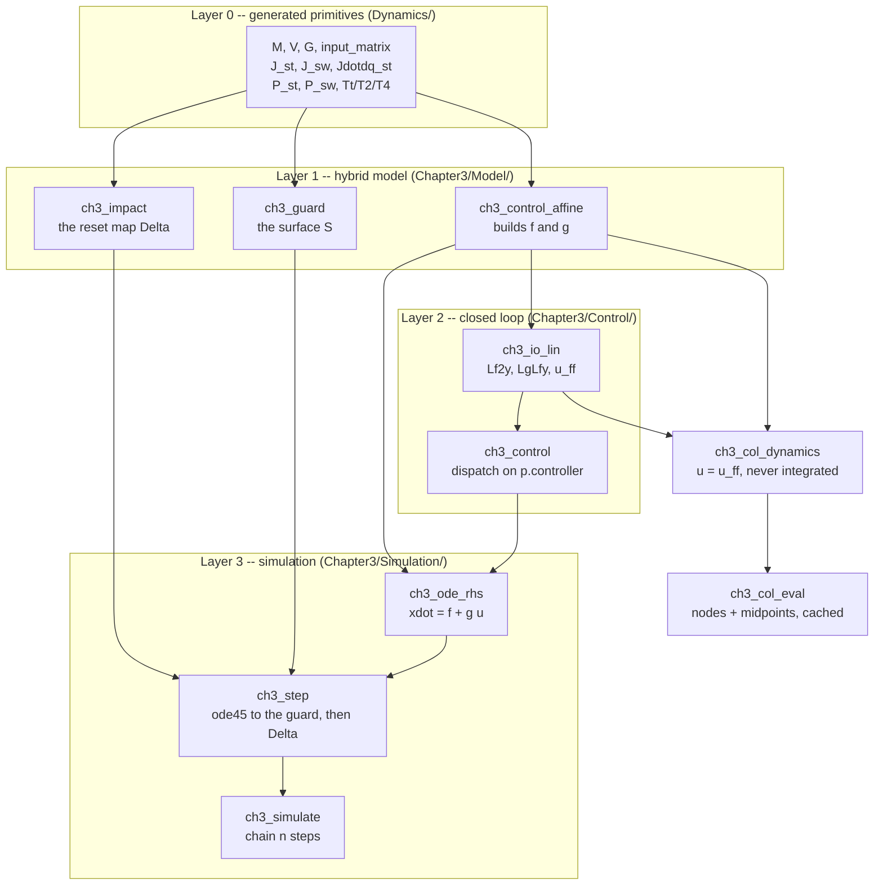

# Chapter 3 — function map

Which function computes what, and who calls it. Derived from the call graph, not
from the folder layout — the two do not always agree.

Companion documents: [`CH3_SEQUENCE.md`](CH3_SEQUENCE.md) is the big picture in
one diagram, [`CH3_OPTIMIZATION_FLOW.md`](CH3_OPTIMIZATION_FLOW.md) expands
stage 3, and [`Chapter3/README.md`](../Chapter3/README.md) is the reference manual
for the pipeline as a whole.

---

## The layers



`ch3_ode_rhs` and `ch3_col_dynamics` are **parallel, not nested**. Both build on
`ch3_control_affine`, and the difference is the whole reason stage 3 and stages
5–8 can be reasoned about separately:

| | `ch3_ode_rhs` | `ch3_col_dynamics` |
|---|---|---|
| input `u` | from `ch3_control` (selected controller) | `u_ff` always |
| integrated? | yes, by `ode45` | **no** — only supplies `f_k` for the defects |
| lives in | the runtime branch | inside the `fmincon` loop |

---

## Layer 0 — generated primitives

All produced by
[`rabbit_energy_model_generalized_Lagrange.m`](../Dynamics/rabbit_energy_model_generalized_Lagrange.m).
These *are* the model; everything above is assembly.

| function | signature | returns | Chapter-3 callers |
|---|---|---|---|
| [`M`](../Dynamics/M.m) | `M(q)` | 7×7 mass matrix | `ch3_control_affine`, `ch3_impact` |
| [`V`](../Dynamics/V.m) | `V([q;dq])` | 7×1 Coriolis / centrifugal | `ch3_control_affine` |
| [`G`](../Dynamics/G.m) | `G(q)` | 7×1 gravity | `ch3_control_affine` |
| [`input_matrix`](../Dynamics/input_matrix.m) | `input_matrix()` | 7×4 `B` | `ch3_control_affine` |
| [`J_st`](../Dynamics/J_st.m) | `J_st(q)` | 2×7 stance-foot Jacobian | `ch3_control_affine`, `ch3_col_constraints` |
| [`J_sw`](../Dynamics/J_sw.m) | `J_sw(q)` | 2×7 swing-foot Jacobian | `ch3_guard`, `ch3_impact` |
| [`Jdotdq_st`](../Dynamics/Jdotdq_st.m) | `Jdotdq_st(q,dq)` | 2×1 | `ch3_control_affine` |
| [`P_st`](../Dynamics/P_st.m) | `P_st(q)` | 2×1 stance-foot position | 9 files — the widest-used primitive |
| [`P_sw`](../Dynamics/P_sw.m) | `P_sw(q)` | 2×1 swing-foot position | `ch3_guard`, `ch3_col_eval`, `ch3_step`, `ch3_forces` |
| `Tt`, `T2`, `T4` | `Tt(q)` | 4×4 homogeneous transform | `ch3_body_points` (drawing only) |

Foot positions are returned in the **world frame, z up-positive**. The
generalized coordinate `y` is stored **down-positive**, so world height is `−y`;
read heights from these helpers, never from `y`.

### Not called at runtime

By *either* pipeline:

| function | status |
|---|---|
| `DM` | only the derivation script calls it — it is the intermediate that generates `V.m` |
| `Jdotdq_sw` | never called anywhere; would be needed only to constrain the swing foot at the acceleration level |
| `T1`, `T3` | never called outside the derivation |

---

## Layer 1 — `f`, `g`, and the hybrid map

| function | role |
|---|---|
| [`ch3_control_affine`](../Chapter3/Model/ch3_control_affine.m) | **the only place `f` and `g` are built.** One KKT factorization with five right-hand sides yields `ddq_drift`, `ddq_in`, `lam_drift`, `lam_in` exactly |
| [`ch3_guard`](../Chapter3/Model/ch3_guard.m) | `h(x)` = swing-foot height; defines the switching surface `S` |
| [`ch3_impact`](../Chapter3/Model/ch3_impact.m) | `Δ` = plastic impact → relabel → re-plant, in that order |
| [`ch3_relabel`](../Chapter3/Model/ch3_relabel.m) | leg index swap; called only by `ch3_impact` |

`ch3_control_affine` has **four call sites** in the entire package —
`ch3_io_lin`, `ch3_ode_rhs`, `ch3_step`, plus tests. Nothing else touches the
constrained dynamics directly.

---

## Layer 2 — closed loop

| function | role |
|---|---|
| [`ch3_io_lin`](../Chapter3/Control/ch3_io_lin.m) | joins stages 1 and 2 → `Lf2y`, `LgLfy`, `u_ff` |
| [`ch3_control`](../Chapter3/Control/ch3_control.m) | single dispatch point on `p.controller` → `u` |
| [`ch3_ctrl_pd`](../Chapter3/Control/ch3_ctrl_pd.m) | stage 5 |
| [`ch3_ctrl_clf_qp`](../Chapter3/Control/ch3_ctrl_clf_qp.m) | stages 7 and 8 |
| [`ch3_res_clf`](../Chapter3/Control/ch3_res_clf.m), [`ch3_clf_eval`](../Chapter3/Control/ch3_clf_eval.m) | stage 6 — the CLF certificate |

Every torque consumer routes through `ch3_control`, which is what makes
"solve under PD, re-check under the constrained CLF-QP" a one-line experiment.

---

## Layer 3 — gait simulation

```
ch3_simulate(x0, alpha, p, n_steps)      chains steps, seeds each from Delta
    └─ ch3_step(x0, alpha, p)            ode45 to the guard, then Delta
         ├─ ch3_ode_rhs(t, x, alpha, p)  xdot = f + g*u
         │    ├─ ch3_control  ──► ch3_io_lin ──► ch3_control_affine
         │    └─ ch3_control_affine
         ├─ ch3_guard        (as the ode45 Events function)
         └─ ch3_impact       (applied at the end of the step)
```

`ch3_step` also holds two local helpers, `integrate_zoh` and `zoh_rhs`, used when
`p.control_dt > 0` — the sampled-data path required by the constrained CLF-QP.

`ch3_ode_rhs` receives `t` and discards it. The feedback is time-invariant by
construction; the argument survives only because `ode45` passes it.

### Who calls the simulation

| caller | calls | why |
|---|---|---|
| [`ch3_report`](../Chapter3/Analysis/ch3_report.m) | `ch3_simulate` | forward-sim cross-check against the collocation |
| [`ch3_compare_controllers`](../Chapter3/Analysis/ch3_compare_controllers.m) | `ch3_simulate` | one gait under all three laws at 1 kHz |
| [`ch3_animate`](../Chapter3/Analysis/ch3_animate.m) | `ch3_simulate` | rendering |
| [`ch3_poincare`](../Chapter3/Analysis/ch3_poincare.m) | `ch3_step` | 26 single steps for the step-to-step Jacobian |
| [`ch3_col_seed`](../Chapter3/Optimization/ch3_col_seed.m) | `ch3_step` | feedforward rollout to build the seed |
| [`ch3_col_verify`](../Chapter3/Optimization/ch3_col_verify.m) | `ch3_ode_rhs` | tight rollout compared against the node states |

---

## The legacy stack

A complete second implementation lives in the repo root and is **not used by
Chapter 3**:

```
Dynamics/     rabbit_dynamics, rabbit_constrained_dynamics, rabbit_ode,
              hzd_ode_rhs, hzd_closed_loop_ode, clf_qp_closed_loop_ode,
              hzd_control_and_dynamics
Simulation/   simulate_one_step, simulate_n_steps, simulate_hzd_gait,
              simulate_hzd_gait_full, simulate_clf_gait
Contact/      rabbit_impact_map, rabbit_impact_event, impact_event_wrapper
Reset_Map/    rabbit_reset_map, relabel_state
Controller/   rabbit_controller, rabbit_clf_qp_controller, theta_of_q, dtheta_dq_of
```

The two stacks share Layer 0 and nothing else — **with one deliberate
exception**: [`rabbit_constrained_dynamics`](../Dynamics/rabbit_constrained_dynamics.m)
is called by [`ch3_test_model`](../Chapter3/Test/ch3_test_model.m) as an
independent reference for the control-affine split. Keeping that one link is
what makes the check meaningful; it is the only place the implementations are
compared against each other.

---

## How this map was derived

Grep for callers of each function name across `Chapter3/` and the legacy
folders, excluding the defining file itself. Two hits are **false positives** and
are excluded above:

- `M(` in `ch3_bezier.m` — the Bézier degree `M`, not the mass matrix.
- `V(` in `ch3_test_control.m` — the CLF value `V`, not the Coriolis vector.

So the mass matrix has exactly two Chapter-3 callers and the Coriolis vector
exactly one. Re-run the same grep after any refactor; a primitive quietly
gaining callers is usually a sign that Layer 1 has been bypassed.
