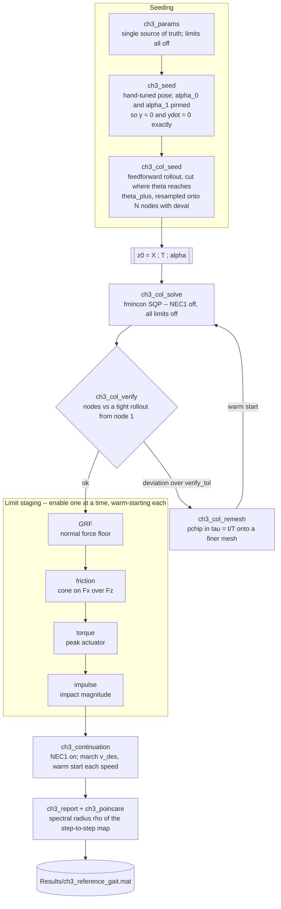
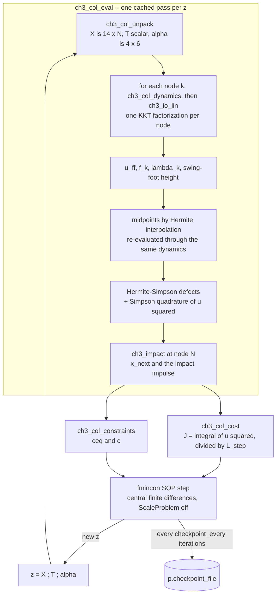

# Chapter 3 — the optimization flow

How stage 3 of the Chapter 3 pipeline actually solves for the Bézier
coefficients `alpha`. Everything here lives in
[`Chapter3/Optimization/`](../Chapter3/Optimization); the reference manual for
the pipeline as a whole is [`Chapter3/README.md`](../Chapter3/README.md).

Section 0 places stage 3 within the chapter as a whole. Everything after it is
about stage 3 itself, where there are **two nested flows** — and conflating them
is what makes the code hard to read the first time:

1. the **outer workflow** — the sequence of solves you run to get from a
   hand-tuned pose to a verified, periodic, stable gait;
2. the **inner evaluation** — what happens on each of the thousands of function
   evaluations `fmincon` makes inside one of those solves.

---

## 0. Where stage 3 sits

The chapter's eight stages are not eight steps. They are a **shared foundation
of three**, then **two flows that never meet at runtime**, then a verdict.


The three grey boxes across the top are stages 1, 2 and 4; the left column is
stage 3; the right column is stages 5-8.

**The foundation is shared, not duplicated.** Stages 1, 2 and 4 are pure
functions of the state — no decisions, no search. `ch3_io_lin` closes the chain
in two lines, calling stage 1 and stage 2 and joining them. The optimizer and
the robot call *the same code*, so there is no separate "planning model" that
can silently drift from the "control model".

**Only `alpha` crosses between the flows.** The decision vector is 235 numbers
at `N = 15`, but 210 of those are node states that exist purely to make the
dynamics algebraic inside `fmincon`. What the robot carries away is 24 numbers.

**`T` does not cross.** Note the runtime signature — `ch3_control(x, alpha, p)`
— and that `ch3_ode_rhs(~, x, alpha, p)` discards time entirely. The gait *has*
a duration (0.3009 s for the shipped reference gait), and the controller never
knows it. `T` is an output of the design, not an input to the control. This is
the phase variable of stage 2 cashing out at the architectural level: the robot
is not replaying a plan on a clock, it is obeying four joint relationships
indexed by its own leg angle, which is exactly why a disturbance re-indexes the
gait instead of desynchronising it.

**The offline flow does not use the online controller.** The solve runs under
`p.controller = 'ff'`, pure feedforward. The gait is designed *on* the zero
dynamics surface `Z = {eta = 0}`, where any feedback term multiplies zero. So
`p.controller` selects what **runs** a gait, never what **designs** it.

**The two flows meet only at verification.** `ch3_report` runs the forward
simulation and compares it against the collocation — on the reference gait,
step length 0.353 m and duration 0.301 s on all six steps, two independent
computations agreeing. Then `ch3_poincare` returns the spectral radius, because
periodicity is a property of the solve and stability is not (§5).

---

## 1. The outer workflow



### Why the workflow has this shape

**The cold solve runs with NEC1 disabled.** NEC1 is the average-rate equality
`L_step / T = v_des`. Finding a *periodic* gait is the hard part of the problem;
pinning the speed at the same time is what makes a cold solve stall. Measured
from the hand seed, periodicity alone starts at a residual of 0.78 while NEC1
starts at 0 — the seed trivially walks at its own speed — so demanding a
different speed immediately fights the constraint that was already binding, and
feasibility oscillates instead of settling. See
[`ch3_col_constraints.m:90`](../Chapter3/Optimization/ch3_col_constraints.m#L90).

**Speed is recovered by continuation, not imposed.** The seed rollout walks at
about 0.12 m/s. Asking a cold solve for 0.35 m/s made `max|ceq|` oscillate
2.76 → 0.10 → 1.05 while the cost fell by half — trading feasibility for
objective and never settling. Marching `v_des` in small steps keeps every
individual solve nearly feasible at its start, which is the regime SQP is good
at. A speed whose solve fails to verify **stops the march**: continuing from a
solution that is not a real trajectory only propagates the problem.

**Limits go on in the order GRF → friction → torque → impulse.** Friction is
`|Fx| / Fz`, so enabling it while `Fz` still crosses zero sets the optimizer
chasing a division by zero. GRF first gets `Fz` positive, and only then does the
cone mean anything.

**Disabled inequalities are held at `-1`, not removed.** A gated constraint is
trivially satisfied but still present, so `c` has a constant length of 8 and
`fmincon`'s problem dimensions never change between runs. That is what makes
"enable them one at a time, warm-starting each phase" a safe workflow rather
than a new problem each time.

**Table 3.1 limits are ATRIAS numbers — measure before enforcing.** ATRIAS is
63 kg with 50:1 harmonic drives, so its `|u| <= 5 Nm` is *motor* torque, 250 Nm
at the joint. RABBIT is ~30 kg and direct drive, so `u` here *is* joint torque.
Copying the numbers across produces an infeasible problem and a solver that
fails for reasons that look like bugs. `ch3_report` prints every limit with its
**measured** value whether or not it is enforced.

---

## 2. Inside one `fmincon` evaluation



### The decision vector

`z = [X(:) ; T ; alpha(:)]` — see
[`ch3_col_pack.m`](../Chapter3/Optimization/ch3_col_pack.m).

| block | shape | size | note |
|---|---|---|---|
| `X` | `nx x N` = 14 x N | 14N | node states |
| `T` | scalar | 1 | step duration, **free** — the gait finds its own timing |
| `alpha` | `ny x n_ctrl` = 4 x 6 | 24 | degree-5 Bézier coefficients |

Total `14N + 25`. At the default `p.N_nodes = 15` that is **235 unknowns**
(319 at N = 21).

`alpha` is what stage 3 is *actually* solving for. The node states exist only to
make the dynamics **algebraic** rather than an ODE inside the optimizer — there
is no ODE solver anywhere in the `fmincon` loop. This is also why
`ch3_col_remesh` can carry `alpha` and `T` across untouched: `alpha` is
mesh-independent by construction.

### Why `ch3_col_eval` is cached

`fmincon` calls the objective and the nonlinear constraints back to back with
the **same** `z`, and does so twice per variable during central differencing.
Evaluating the nodes in both places would double the cost of the entire solve,
so the work happens once in `ch3_col_eval` and both callers read the cached
result. The cache holds the last `z` only, which is all the access pattern
needs.

### The transcription

Hermite–Simpson, with `h = T / (N - 1)`:

```
x_mid  = (x_k + x_k+1)/2 + (h/8)(f_k - f_k+1)
defect = x_k+1 - x_k - (h/6)(f_k + 4 f_mid + f_k+1)
```

Driving the defects to zero **is** the dynamics constraint. Two consequences
that matter: the stance foot is pinned at every node rather than only
integrated, so contact cannot drift during a step; and the same Simpson weights
that define the defects also integrate the cost, so cost and dynamics use one
consistent quadrature.

### The input inside the solve is pure feedforward

```
u = u_ff(x, alpha) = -(Lg Lf y)^-1 Lf^2 y
```

exactly the torque that holds `ydd = 0`. No feedback term, deliberately: the
solve constrains the trajectory to start **on** the zero dynamics surface
`Z = {eta = 0}`, and `u_ff` renders `Z` invariant, so `eta` stays zero along the
whole step and any PD or CLF term would be multiplying zero. `p.controller`
selects what *runs* the resulting gait, not what designs it.

This is also why the stage-3 cost is the honest one: the torque being integrated
is the torque the gait actually requires, not a tracking transient.

The control-affine split is **exact**, not finite-differenced — the
single-support KKT system has the same left-hand matrix for every input, so one
factorization with five right-hand sides recovers
`ddq = ddq_drift + ddq_in * u` and `lambda = lam_drift + lam_in * u`.

---

## 3. The problem statement

### Objective — [`ch3_col_cost.m`](../Chapter3/Optimization/ch3_col_cost.m)

```
J = (1 / L_step) * integral_0^T ||u(t)||_2^2 dt
```

**The division by `L_step` is not cosmetic.** Without it a shorter step is
simply cheaper — the integral shrinks with the distance travelled — so the
optimizer is actively rewarded for shrinking the stride until the robot steps in
place. Normalizing turns the objective into **energy per distance** and removes
the degeneracy at the source rather than patching it with a constraint. The
step-length floor is still enforced, but only as a backstop.

The denominator is floored **smoothly**: below `p.step_len_min` the cost
transitions to a quadratic penalty rather than a cliff, so `J` stays continuous
and differentiable even when `L_step` passes through zero far from feasibility.
A discontinuous objective is far more damaging to an SQP method than a slightly
inaccurate one.

### Equalities — `ceq`

| # | block | count | count at N = 15 |
|---|---|---|---|
| 1 | node 1 on `Z`: `y = 0`, `ydot = 0` | 8 | 8 |
| 2 | node 1 phase clock: `theta = theta_minus` | 1 | 1 |
| 3 | node 1 gauge: `P_st(q_1) = [0;0]`, `J_st(q_1) dq_1 = 0` | 4 | 4 |
| 4 | Hermite–Simpson defects | `nx (N-1)` | 196 |
| 5 | node N on the guard: `theta = theta_plus`, swing-foot height 0 | 2 | 2 |
| 6 | periodicity `Delta(x_N) - x_1 = 0`, **excluding** `px` | `nx - 1` | 13 |
| 7 | NEC1 `L_step / T = v_des` *(gated; 0 when off)* | 1 | 1 |
| | **total** | `29 + nx(N-1)` | **225** |

225 equalities against 235 unknowns.

**Why the node-1 conditions are imposed only at node 1.** `y = 0`, `ydot = 0`
and the contact conditions are all *invariant* under the collocation dynamics:
`u_ff` renders `ydd = 0` exactly, so `y` evolves linearly in `t`, and
Hermite–Simpson is exact for cubics — it reproduces a linear `y` with no
truncation error at all. Imposing them at every node instead would add
`12(N-1)` equations the defects already imply, over-determining the system
(532 equations against 319 unknowns at N = 21) and leaving `fmincon` to fight a
rank-deficient KKT matrix. `ch3_report` measures the residual drift across the
step to confirm this holds in practice rather than only in theory.

**Why `px` is excluded from periodicity.** `px` is the translation gauge and
must advance; requiring it to repeat would demand the robot end where it
started, i.e. not walk.

### Inequalities — `c`, always length 8

| # | constraint | gate |
|---|---|---|
| 1 | swing-foot clearance at mid-step (NIC3) | `limits.enable.clearance` |
| 2 | no ground penetration at interior nodes | always |
| 3 | step-length floor | always |
| 4 | peak torque, over nodes **and** midpoints | `limits.enable.torque` |
| 5 | friction cone | `limits.enable.friction` |
| 6 | minimum normal force | `limits.enable.grf` |
| 7 | impact impulse magnitude | `limits.enable.impulse` |
| 8 | reserved, held at `-1` | — |

Torque is checked at midpoints as well as nodes because a midpoint can exceed
both of its neighbours; checking nodes only would under-report the peak.

### Bounds — [`ch3_col_bounds.m`](../Chapter3/Optimization/ch3_col_bounds.m)

Sanity rails, not physics. Their job is to stop `fmincon` wandering into poses
where the generated trig is meaningless (a torso rotated past vertical, a knee
folded through itself) or velocities large enough that the KKT solve loses
conditioning — a single bad evaluation early on can poison a whole solve.
`T` is boxed by `[T_min, T_max]` and `alpha` by `[-3, 3]`.

### Solver options, and why

| option | value | reason |
|---|---|---|
| `Algorithm` | `sqp` | the transcription is mostly equality constrained with a smooth objective, which is where SQP is strongest; interior-point spends its effort on a barrier that has little to do here |
| `FiniteDifferenceType` | `central` | constraint values pass through a KKT solve and a matrix inversion, so forward differences at the default step lose too many digits near a well-conditioned solution |
| `ScaleProblem` | `false` | so the Feasibility number `fmincon` reports is directly comparable to `ConstraintTolerance` rather than to a rescaled surrogate |
| `OptimalityTolerance` | `1e-6` | |
| `ConstraintTolerance` | `1e-6` | |
| `StepTolerance` | `1e-10` | |
| `OutputFcn` | checkpoint | writes `z` every `p.checkpoint_every` iterations; a crash then costs minutes, not a run, and the checkpoint doubles as a warm start |

---

## 4. The gate: small defects do not mean a real trajectory

**This is the check that keeps direct collocation honest, and it is not
optional.** See
[`ch3_col_verify.m`](../Chapter3/Optimization/ch3_col_verify.m).

Small defects mean the *discrete* equations are satisfied. They do **not** mean
the node states approximate a solution of the ODE. On a mesh too coarse for the
dynamics, the optimizer will happily find a **spurious discrete solution**, and
every number derived from it — step length, duration, speed, cost, the
Table 3.1 quantities — is then fiction.

Measured on this project, at N = 15 on a fully converged solve:

```
interval-1 defect                      7.18e-07
|x_2(collocation) - x_2(true flow)|    3.68e-02      <- five orders worse
```

The tell was `max|eta| = 0.41` at the interior nodes when node 1 satisfied
`eta = 0` to 5e-7. Since `u_ff` makes `ydd = 0` *exactly*, `eta` can only drift
through discretization error — so large `eta` with a small node-1 residual is a
**mesh diagnostic**, not a modelling error. The accelerations reached
81 rad/s², so `dq` moved by ~2.3 within one `h = 0.072 s` interval;
Hermite–Simpson's truncation error had no chance. The forward simulation
disagreed with the collocation (T: 1.00 s vs 0.72 s), which is how it surfaced.

The check integrates the closed-loop ODE from node 1 at `RelTol 1e-11` and
compares against the node states at the same times. `ch3_col_solve` runs it
automatically and prints a warning; `ch3_report` prints **REJECT**. The cure is
mesh refinement via `ch3_col_remesh`, warm-starting from the coarse solution —
going straight to a fine mesh from a cold start is both slower per iteration and
more likely to stall, because the coarse solve does the cheap structural work
first.

## 5. Periodic is not stable

The periodicity equality makes the start state a **fixed point** of the
step-to-step map. A fixed point can repel. `ch3_poincare` returns the spectral
radius `rho` of that map's Jacobian: `rho < 1` attracts (walks), `rho >= 1`
repels (falls), no matter how small the periodicity residual is. It costs 26
step simulations, which is why it is a post-hoc diagnostic rather than a
constraint.

The shipped reference gait reaches `rho = 0.760`.

---

## File map

| file | role |
|---|---|
| [`ch3_seed.m`](../Chapter3/Optimization/ch3_seed.m) | analytic starting `alpha` consistent with a given start state |
| [`ch3_col_seed.m`](../Chapter3/Optimization/ch3_col_seed.m) | rolls the seed out under feedforward and samples nodes on the **phase** |
| [`ch3_col_pack.m`](../Chapter3/Optimization/ch3_col_pack.m) / [`ch3_col_unpack.m`](../Chapter3/Optimization/ch3_col_unpack.m) | decision-vector layout |
| [`ch3_col_bounds.m`](../Chapter3/Optimization/ch3_col_bounds.m) | box bounds |
| [`ch3_col_dynamics.m`](../Chapter3/Optimization/ch3_col_dynamics.m) | closed-loop RHS under pure feedforward |
| [`ch3_col_eval.m`](../Chapter3/Optimization/ch3_col_eval.m) | the cached single pass over all nodes and midpoints |
| [`ch3_col_cost.m`](../Chapter3/Optimization/ch3_col_cost.m) | torque-squared per unit distance |
| [`ch3_col_constraints.m`](../Chapter3/Optimization/ch3_col_constraints.m) | `ceq` and `c` |
| [`ch3_col_solve.m`](../Chapter3/Optimization/ch3_col_solve.m) | the `fmincon` driver, with checkpointing |
| [`ch3_col_verify.m`](../Chapter3/Optimization/ch3_col_verify.m) | nodes vs a true rollout |
| [`ch3_col_remesh.m`](../Chapter3/Optimization/ch3_col_remesh.m) | move a solution onto a finer mesh |
| [`ch3_col_resume.m`](../Chapter3/Optimization/ch3_col_resume.m) | run a bounded chunk of a solve from a checkpoint, one MATLAB process per chunk |
| [`ch3_continuation.m`](../Chapter3/Optimization/ch3_continuation.m) | march `v_des`, warm-starting each speed |
